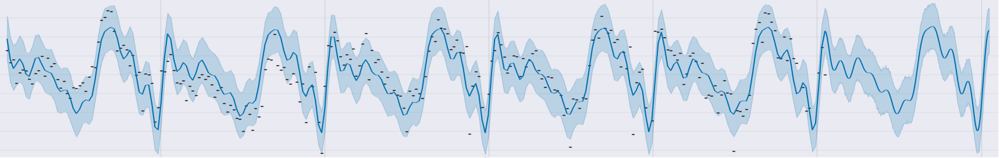
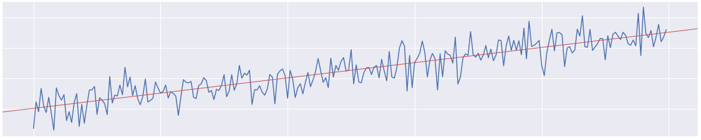

---
jupyter:
  jupytext:
    text_representation:
      extension: .md
      format_name: markdown
      format_version: '1.2'
      jupytext_version: 1.3.2
  kernelspec:
    display_name: Python 3
    language: python
    name: python3
---

# Welcome to Time Series! #

In this micro-course you'll learn an invaluble skill: how to predict the future!



After completing this micro-course, you'll be able to:
- Forecast the popularity of a search term with linear regression.
- Predict the daily page-views of a website with [Prophet](https://facebook.github.io/prophet/).
- Estimate market demand for a ride-sharing company with XGBoost.
- Discover highly-profitable customers with a Markov model. And,
- Build a deep learning model with Keras to predict the weather.

You'll be prepared for this micro-course if you know how to [construct a machine learning model](https://www.kaggle.com/dansbecker/your-first-machine-learning-model), [manipulate dataframes with Pandas](https://www.kaggle.com/residentmario/indexing-selecting-assigning), and [use seaborn to explore your data](https://www.kaggle.com/alexisbcook/hello-seaborn). You'll have a leg up if you've done some work on the [House Prices: Advanced Regression Techniques](https://www.kaggle.com/c/house-prices-advanced-regression-techniques) competition, but we'll review what we need as we go.


# What is a Time Series? #

A **time series** is simply a sequence of observations together with the times those observations occured. The times provide an **index** to the observations. Usually, the observations will have been made over some fixed time interval, like every hour or every month.

Time series are very common. They occur virtually anywhere data is collected sequentially over time. Time series are used to analyze such things as economic growth, volatility in financial markets, EEG brainwave signals, and natural disasters like earthquakes and volcanoes.

The defining characteristic of time series is that their observations are **sequentially dependent**. How the observations are ordered in time is important. This is different from ordinary datasets where the rows can be taken in any order without affecting the analysis.

Time series analysis is mostly about working with the extra information that this time dependence provides. Over this micro-course, you'll learn about a number of models especially designed for time series and what to do to make sure you get the most from your data.


# Your Problem #

Let's suppose you work for a book publisher. Your boss has heard that data science has been getting popular. She thinks there could be a market opportunity for a new textbook, but she wants to know if this popularity will continue. She asks you to describe how interest in data science has been trending over the past five years and to make a forecast one year into the future.

You turn to [Google Trends](https://trends.google.com/trends/). With Google Trends you can get a report of how popular a search term has been over time. For your analysis, you decide to investigate the term "data science", and you retrieve a CSV file for the period of January 25, 2015 to January 25, 2020, with observations taken weekly. (Click 
[here](https://trends.google.com/trends/explore?date=2015-01-25%202020-01-25&geo=US&q=data%20science) for an interactive graph of this dataset.)

First, let's load the data into a Pandas DataFrame.

```python
import pandas as pd
pd.plotting.register_matplotlib_converters()

# Read the file into a variable 'datascience'
# Parse the 'Week' column as a date and set it as the index
datascience = pd.read_csv('../data/datascience.csv', parse_dates=['Week'], index_col='Week')
```

And let's get a quick overview.

```python
# View the first five weeks of the dataset
datascience.head()
```

The numbers in the `Interest` column represent the popularity for that week relative to when the term was most popular over the time observed. Google says, "A value of 100 is the peak popularity for the term. A value of 50 means that the term is half as popular. A score of 0 means there was not enough data for this term."

It's good to look at some summary statistics, as well.

```python
datascience.describe()
```

# Plotting Time Series #

```python
import matplotlib.pyplot as plt
%matplotlib inline
```

Time series are commonly represented as [line charts](https://www.kaggle.com/alexisbcook/line-charts), with the index along the x-axis. A line chart emphasizes the ordered nature of a time series.

You can quickly plot a time series with the `DataFrame.plot` method. For time series, `pandas` will create a line chart by default.

```python
datascience.plot();
```

For more detailed plots, we'll turn to [seaborn](https://seaborn.pydata.org/index.html). You may have learned about `seaborn` in a [previous micro-course](https://www.kaggle.com/learn/data-visualization). `seaborn` is a powerful and flexible supplement to `matplotlib` for statistical visualization.

First let's set up the plotting environment.

```python
import seaborn as sns

# With 'sns.set' you can set default parameters for your plots
# With no arguments, it sets the parameters to the seaborn 'darkgrid' style
sns.set()

# 'plt.rc' modifies default matplotlib properties
# You can also pass these as a dictionary to 'sns.set'
plt.rc('axes', labelweight='bold', labelsize='large',
       titleweight='bold', titlesize='x-large')
plt.rc('xtick', labelsize='large')
plt.rc('ytick', labelsize='large')
plt.rc('legend', fontsize='large')
```

Now we can get a better visualization of our time series. You can add method calls to `plt` to add or modify features of your plot.

```python
plt.figure(figsize=(16,6))
plt.title("Popularity of 'data science'")
# Use 'sns.lineplot' when plotting time series
sns.lineplot(data=datascience);
```


# Fitting a Trend-Line #

Because time series are temporally dependent, there ought to be some predictive information in the time index itself. We should be able to treat the time index as a feature.

The time-dependence in a time series can occur in many ways. One of the most important is through a **trend**, meaning a steady rise or fall in the series. Whenever a series is constantly increasing or constantly decreasing on the average, we can capture this trend with a line.

For our first model in this micro-course, we will fit a **linear trend-line** using [simple linear regression](https://en.wikipedia.org/wiki/Simple_linear_regression). Our trend-line model will fit a least-squares line with `Interest` as the target and `Week` as the feature. See the next figure for an example of a linear trend-line.

|  |
|:--:|
| *A Time Series with a Linear Trend and a Trend-Line* |

# Prepare Data #

We will follow the usual procedure of evaluating our model with a training set and a validation set. There are two issues we must address, however, before splitting the data.

First, the least-squares algorithm requires numeric features. Since the `Week` variable is a date type, we can't construct the model on it directly. Instead, we represent it with a **time dummy**. The time dummy is just an enumeration of the periods in the time series, beginning at 1. The time dummy for `Week` will go: 1, 2, 3, ..., 261, one for each week.

```python
# Construct the "time dummy": 1, 2, 3, ...
datascience['Week'] = range(1, len(datascience.index) + 1)

# Check the result
# View the first five weeks of the dataset
datascience.head()
```

```python
# View the last five weeks of the dataset
datascience.tail()
```

The second thing is that we need to be careful when splitting the data into the training set and validation set. Ordinarily, it is good practice to shuffle your dataset before splitting to ensure the splits are statistically independent. Time series models, however, rely on the data *not* being independent. We must make sure when splitting to **preserve the original order**.

Also, in forecasting, we use information about the past to predict the future. How we validate a model should always reflect how we will use that model in practice, so we want to make sure that all of the validation data occurs *after* the training data. With time series, **the validation set should always be later in time than the training set**.

```python
from sklearn.model_selection import train_test_split

# Split the data into a training set and a validation set
# The order of the observations is important, so don't shuffle
# And have the training set come before the validation set
train_data, val_data = train_test_split(datascience, test_size = 0.2, shuffle = False)
```

Now let's check that we get what we expected.

```python
# The end of the training set...
train_data.tail()
```
```python
# ... should be before the beginning of the validation set
val_data.head()
```


# Define and Fit the Model #

Many of our models for this micro-course will come from the `statsmodels` library. `statsmodels` is like the `sklearn` of time series.

The easiest way to get started with `statsmodels` is through its [formula interface](https://www.statsmodels.org/stable/example_formulas.html). Formulas in `statsmodels` work the same way as formulas in R. Instead of passing in our variables as arrays (like in `sklearn`), in `statsmodels` we can specify the regression relationship with a special kind of string and let `statsmodels` create the arrays for us.

For simple linear regression, we write the formula as: `'target ~ feature'`.

```python
import statsmodels.formula.api as smf

# Fit an ordinary least-squares model using the formula interface
datascience_model = smf.ols('Interest ~ Week', train_data).fit()

# Look at the fitted coefficients of the least-squares line
datascience_model.params
```

The `Intercept` parameter tells us the y-intercept for the line and the `Week` parameter tells us the slope. The coefficients tell us that we should predict about 27 points of Interest for the first week, and about 0.24 more points for every week that goes by.


# Evaluate the Model #

We'll evaluate our predictions with [root-mean-square error](https://en.wikipedia.org/wiki/Root-mean-square_deviation) (RMSE). In future lessons, we'll learn other metrics often used for time series, and also learn about the best way to perform [cross-validation](https://www.kaggle.com/alexisbcook/cross-validation).

```python
from sklearn.metrics import mean_squared_error

# In-sample predictions (the fitted values) and RMSE (the residuals)
train_predictions = datascience_model.predict(train_data)
rmse_train = mean_squared_error(train_data.Interest, train_predictions, squared=False)

# Out-of-sample predictions (the forecast) and RMSE
val_predictions = datascience_model.predict(val_data)
rmse_val = mean_squared_error(val_data.Interest, val_predictions, squared=False)

print("RMSE of fitted predictions:")
print(rmse_train)
print()
print("RMSE of forecast predictions:")
print(rmse_val)
```

The error increased by about 38% from the training set to the validation set. This suggests that our model is having trouble generalizing. Something about the behavior of the time series changed from the training period to the validation period and our model was not able to capture that.


# Interpret Predictions #

Let's make a plot of our predictions to get a better idea of what's going on.

```python
# Set the width and height of the figure
plt.figure(figsize=(16,6))

# Plot the time series
sns.lineplot(data=datascience.Interest, alpha=0.5)

# Plot the trend-line on the training set
sns.lineplot(data=train_predictions, label='Fitted', color='b')

# Plot the trend-line on the validation set
sns.lineplot(data=val_predictions, label='Forecast', color='r');

# Set labels
plt.title("Fitted and forecast predictions")
plt.xlabel("Date")
plt.ylabel("Interest")
plt.legend(title="Predictions");
```

You can see that the popularity of "data science" tends to fall in the summer and winter and rise the spring and fall. (Students on break from school?) It's apparent that there is information we aren't using that could help us make our predictions better. Later we'll see models that can make use of this kind of seasonal pattern.

What report would you give your boss? How confident would you be in a forecast made from this model?


# Conclusion #

The defining property of time series is their *dependence on a temporal order*. This temporal dependence is both a useful source of information and also a strong constraint. To get the most from a time series we should make use of its patterns of behavior over time. Preserving this information, however, requires us to modify our usual practices.

In this lesson we looked at a number important topics: trends and seasons in time series, the importance of preserving the temporal order, and how a model can make use of this ordering. These topics are central to an understanding of time series and they will recur throughout this course.


# Your Turn #

Now you know how to make forecasts using a linear trend-line. When you're ready, move on to the first exercise!
